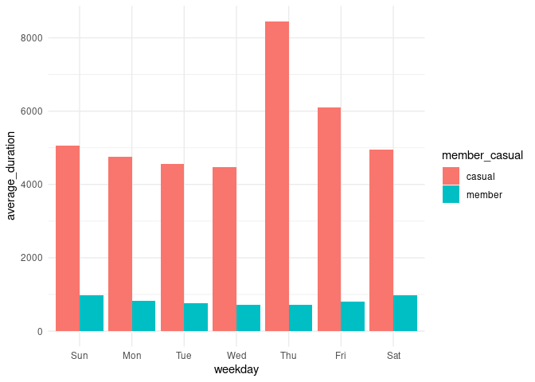

Capstone: Bike-sharing Data Analysis
================
Anna Papalexopoulou
2024-11-04

# Introduction

Divvy, a bike-sharing service operated by Lyft Bikes and Scooters, LLC
in Chicago, offers residents and visitors a convenient and flexible
means of transportation. With a fleet of 5,824 geotracked bikes across
692 stations, riders can unlock a bike at any station and return it to
another, providing a sustainable, point-to-point transit solution
throughout the city. This service caters to diverse user needs, from
daily commuting to leisurely exploration.

**Business Task:** To strengthen its revenue base, Divvy aims to convert
more casual riders—those who pay per ride—into annual members. Annual
memberships not only provide reliable, recurring revenue but also build
a loyal user base, essential for the company’s long-term growth. This
analysis seeks to identify the behavioral differences between casual
riders and annual members, using data-driven insights to suggest
strategies that could effectively encourage casual users to become
members.

**Data Source:** This analysis leverages historical trip data from Q1
2019 and Q1 2020, made publicly available by Motivate International Inc.
under its [license
agreement](https://divvybikes.com/data-license-agreement). Covering two
quarters, this comprehensive dataset offers insights into user behaviors
across both casual and annual members without including personally
identifiable information, making it suitable for understanding broad
usage patterns while preserving privacy.

# Executive Summary

This analysis of Divvy’s bike-sharing data reveals significant
differences in the behavior of casual riders versus annual members,
shedding light on opportunities to increase memberships through tailored
strategies. These findings highlight how Divvy can encourage casual
riders to consider the advantages of an annual membership, which would
provide a steady, recurring revenue stream for the company. Key insights
into user behavior include:

**Usage Patterns:** Casual riders primarily use Divvy bikes on weekends
and afternoons, suggesting they rely on the service for leisure rather
than daily transportation. Conversely, members ride more consistently on
weekdays, indicating that Divvy serves as a practical commuting solution
for them.

**Ride Duration:** The average ride length is notably longer for casual
riders, supporting the hypothesis that their rides are more leisurely
and exploratory. In contrast, members’ trips are shorter and more
aligned with commuting distances.

**Peak Hours and Station Preferences:** Members’ usage peaks during
traditional commuting hours and is concentrated at stations near
residential and business districts. Casual riders, on the other hand,
are most active in the early afternoon and prefer stations closer to
tourist and recreational areas, aligning with a focus on experiences
rather than routine travel.

**Recommendations Preview:** These insights lead to targeted strategies
to help Divvy convert casual riders to members. For example,
implementing promotional campaigns at high-traffic stations popular with
casual riders could highlight the cost savings of membership. Flexible,
seasonal, and commuter-friendly membership options could appeal to
different types of casual riders, and incentives for weekday or off-peak
usage might help casual riders envision Divvy as part of their regular
routine. Detailed recommendations are presented in the final section of
this report.

# \[Step 1\] - Load Libraries and Collect Data

``` r
# Load libraries for data wrangling and conflict management
library(tidyverse)
library(conflicted)

# Set dplyr::filter and dplyr::lag as defaults to resolve conflicts
conflict_prefer("filter", "dplyr")
conflict_prefer("lag", "dplyr")

# Load Divvy datasets (csv files)
q1_2019 <- read_csv("Divvy_Trips_2019_Q1.csv")
q1_2020 <- read_csv("Divvy_Trips_2020_Q1.csv")
```

# \[Step 2\] - Wrangle Data and Combine into a Single File

## Ensure Consistent Column Names

``` r
# Compare column names and rename for consistency
colnames(q1_2019)
```

    ##  [1] "trip_id"           "start_time"        "end_time"          "bikeid"           
    ##  [5] "tripduration"      "from_station_id"   "from_station_name" "to_station_id"    
    ##  [9] "to_station_name"   "usertype"          "gender"            "birthyear"

``` r
colnames(q1_2020)
```

    ##  [1] "ride_id"            "rideable_type"      "started_at"         "ended_at"          
    ##  [5] "start_station_name" "start_station_id"   "end_station_name"   "end_station_id"    
    ##  [9] "start_lat"          "start_lng"          "end_lat"            "end_lng"           
    ## [13] "member_casual"

``` r
# Rename columns to match q1_2020 structure
q1_2019 <- rename(q1_2019,
                  ride_id = trip_id,
                  rideable_type = bikeid,
                  started_at = start_time,
                  ended_at = end_time,
                  start_station_name = from_station_name,
                  start_station_id = from_station_id,
                  end_station_name = to_station_name,
                  end_station_id = to_station_id,
                  member_casual = usertype)
```

## Stack Dataframes and Remove Unneeded Columns

``` r
# Inspect the dataframes and look for incongruencies
str(q1_2019)
str(q1_2020)

# Convert ride_id and rideable_type to character so that they can stack correctly
q1_2019 <-  mutate(q1_2019, ride_id = as.character(ride_id)
                   ,rideable_type = as.character(rideable_type)) 

# Stack individual quarter's data frames into one big data frame
all_trips <- bind_rows(q1_2019, q1_2020) #if we had data on other quarters, we would add them respectively ... , q3_2019, q4_2019, q1_2020)

# Remove lat, long, birthyear, and gender fields as this data was dropped beginning in 2020
all_trips <- all_trips %>%  
  select(-c(start_lat, start_lng, end_lat, end_lng, birthyear, gender,  "tripduration"))
```

# \[Step 3\] - Clean and Prepare Data for Analysis

Inspect the new table that has been created

``` r
colnames(all_trips)  #List of column names
```

    ##  [1] "ride_id"            "started_at"         "ended_at"           "rideable_type"     
    ##  [5] "start_station_id"   "start_station_name" "end_station_id"     "end_station_name"  
    ##  [9] "member_casual"      "date"               "month"              "day"               
    ## [13] "year"               "day_of_week"        "ride_length"

``` r
nrow(all_trips)  #How many rows are in data frame?
```

    ## [1] 791956

``` r
summary(all_trips)  #Statistical summary of data. Mainly for numerics
```

    ##    ride_id            started_at                        ended_at                     
    ##  Length:791956      Min.   :2019-01-01 00:04:37.00   Min.   :2019-01-01 00:11:07.00  
    ##  Class :character   1st Qu.:2019-02-28 17:04:04.75   1st Qu.:2019-02-28 17:15:58.75  
    ##  Mode  :character   Median :2020-01-07 12:48:50.50   Median :2020-01-07 13:02:50.00  
    ##                     Mean   :2019-09-01 11:58:08.35   Mean   :2019-09-01 12:17:52.17  
    ##                     3rd Qu.:2020-02-19 19:31:54.75   3rd Qu.:2020-02-19 19:51:54.50  
    ##                     Max.   :2020-03-31 23:51:34.00   Max.   :2020-05-19 20:10:34.00  
    ##                                                                                      
    ##  rideable_type      start_station_id start_station_name end_station_id  end_station_name  
    ##  Length:791956      Min.   :  2.0    Length:791956      Min.   :  2.0   Length:791956     
    ##  Class :character   1st Qu.: 77.0    Class :character   1st Qu.: 77.0   Class :character  
    ##  Mode  :character   Median :174.0    Mode  :character   Median :174.0   Mode  :character  
    ##                     Mean   :204.4                       Mean   :204.4                     
    ##                     3rd Qu.:291.0                       3rd Qu.:291.0                     
    ##                     Max.   :675.0                       Max.   :675.0                     
    ##                                                         NA's   :1                         
    ##  member_casual           date               month               day           
    ##  Length:791956      Min.   :2019-01-01   Length:791956      Length:791956     
    ##  Class :character   1st Qu.:2019-02-28   Class :character   Class :character  
    ##  Mode  :character   Median :2020-01-07   Mode  :character   Mode  :character  
    ##                     Mean   :2019-08-31                                        
    ##                     3rd Qu.:2020-02-19                                        
    ##                     Max.   :2020-03-31                                        
    ##                                                                               
    ##      year           day_of_week         ride_length      
    ##  Length:791956      Length:791956      Min.   :    -552  
    ##  Class :character   Class :character   1st Qu.:     328  
    ##  Mode  :character   Mode  :character   Median :     537  
    ##                                        Mean   :    1184  
    ##                                        3rd Qu.:     910  
    ##                                        Max.   :10632022  
    ## 

``` r
#Additional function we could use to inspect data
head(all_trips)  #See the first 6 rows of data frame.  Also tail(all_trips)
str(all_trips)  #See list of columns and data types (numeric, character, etc)
```

There are a few problems we will need to fix:

1.  In the “member_casual” column, there are two names for members
    (“member” and “Subscriber”) and two names for casual riders
    (“Customer” and “casual”). We will need to consolidate that from
    four to two labels.
2.  The data can only be aggregated at the ride-level, which is too
    granular. We will want to add some additional columns of data - such
    as day, month, year - that provide additional opportunities to
    aggregate the data.
3.  We will want to add a calculated field for length of ride since the
    2020Q1 data did not have the “tripduration” column. We will add
    “ride_length” to the entire dataframe for consistency.
4.  There are some rides where tripduration shows up as negative,
    including several hundred rides where Divvy took bikes out of
    circulation for Quality Control reasons. We will want to delete
    these rides.

## 1. Consolidate Member and Casual Labels

``` r
#Reassign to standard member/casual labels for consistency
## Before 2020, Divvy used different labels for these two types of riders ... we will want to make our dataframe consistent with their current nomenclature

# Begin by seeing how many observations fall under each usertype
table(all_trips$member_casual)
```

    ## 
    ## casual member 
    ##  71643 720313

``` r
# Reassign to the desired values (we will go with the current 2020 labels)
all_trips <-  all_trips %>% 
  mutate(member_casual = recode(member_casual
                                ,"Subscriber" = "member"
                                ,"Customer" = "casual"))

# Check to make sure the proper number of observations were reassigned
table(all_trips$member_casual)
```

    ## 
    ## casual member 
    ##  71643 720313

## 2. Add Date Components

``` r
# Add columns that list the date, month, day, and year of each ride
# This will allow us to aggregate ride data for each month, day, or year ... before completing these operations we could only aggregate at the ride level
all_trips$date <- as.Date(all_trips$started_at) #The default format is yyyy-mm-dd
all_trips$month <- format(as.Date(all_trips$date), "%m")
all_trips$day <- format(as.Date(all_trips$date), "%d")
all_trips$year <- format(as.Date(all_trips$date), "%Y")
all_trips$day_of_week <- format(as.Date(all_trips$date), "%A")
```

## 3. Add Ride Length

``` r
# Add a "ride_length" calculation to all_trips (in seconds)
all_trips$ride_length <- difftime(all_trips$ended_at,all_trips$started_at)

# Inspect new summary
summary(all_trips$ride_length)
```

    ##   Length    Class     Mode 
    ##   791956 difftime  numeric

``` r
# Convert "ride_length" from Factor to numeric so we can run calculations on the data
is.factor(all_trips$ride_length)
```

    ## [1] FALSE

``` r
all_trips$ride_length <- as.numeric(as.character(all_trips$ride_length))
is.numeric(all_trips$ride_length)
```

    ## [1] TRUE

## 4. Remove Inaccurate Data

``` r
# The dataframe includes a few hundred entries when bikes were taken out of docks and checked for quality by Divvy or ride_length was negative
# We will create a new version of the dataframe (v2) since data is being removed
all_trips_v2 <- all_trips[!(all_trips$start_station_name == "HQ QR" | all_trips$ride_length<0),]
```

# \[Step 4\] - Conduct Descriptive Analysis

To unveil patterns in the bike usage of casual riders and annual members
that can indicate possible conversion strategies, we will analyze:

1.  Ride Lengths by User Type
2.  Ride Counts by Day of the Week per user type
3.  Peak Ride Hours by User Type
4.  Most Popular Stations by User Type
5.  Most Popular Routes by User Type

## 1. Ride Lengths by User Type

``` r
# Summarize ride length statistics by user type
summary_by_type <- all_trips_v2 %>%
  group_by(member_casual) %>%
  summarise(
    average_ride_length = mean(ride_length, na.rm = TRUE), #straight average (total ride length / rides)
    median_ride_length = median(ride_length, na.rm = TRUE), #midpoint number in the ascending array of ride lengths
    max_ride_length = max(ride_length, na.rm = TRUE), #longest ride
    min_ride_length = min(ride_length, na.rm = TRUE) #shortest ride
  )
summary_by_type
```

    ## # A tibble: 2 × 5
    ##   member_casual average_ride_length median_ride_length max_ride_length min_ride_length
    ##   <chr>                       <dbl>              <dbl>           <dbl>           <dbl>
    ## 1 casual                      5373.               1393        10632022               2
    ## 2 member                       795.                508         6096428               1

``` r
# Visualization for average ride duration per user
all_trips_v2 %>% 
  mutate(weekday = wday(started_at, label = TRUE)) %>% 
  group_by(member_casual, weekday) %>% 
  summarise(number_of_rides = n()
            ,average_duration = mean(ride_length)) %>% 
  arrange(member_casual, weekday)  %>% 
  ggplot(aes(x = weekday, y = average_duration, fill = member_casual)) +
  geom_col(position = "dodge") +
    theme_minimal()
```

<!-- -->

**Summary**: Casual riders typically have longer ride lengths compared
to members, suggesting more recreational usage.

## 2. Ride Counts by Day of the Week per User Type

``` r
# Weekly ride counts for each user type
weekly_rides <- all_trips_v2 %>%
  mutate(day_of_week = ordered(day_of_week, levels=c("Monday", "Tuesday", "Wednesday", "Thursday", "Friday", "Saturday", "Sunday"))) %>%
  group_by(member_casual, day_of_week) %>%
  summarise(number_of_rides = n())

print(weekly_rides)
```

    ## # A tibble: 14 × 3
    ## # Groups:   member_casual [2]
    ##    member_casual day_of_week number_of_rides
    ##    <chr>         <ord>                 <int>
    ##  1 casual        Monday                 5591
    ##  2 casual        Tuesday                7311
    ##  3 casual        Wednesday              7690
    ##  4 casual        Thursday               7147
    ##  5 casual        Friday                 8013
    ##  6 casual        Saturday              13473
    ##  7 casual        Sunday                18652
    ##  8 member        Monday               110430
    ##  9 member        Tuesday              127974
    ## 10 member        Wednesday            121902
    ## 11 member        Thursday             125228
    ## 12 member        Friday               115168
    ## 13 member        Saturday              59413
    ## 14 member        Sunday                60197

``` r
# Visualization
ggplot(data = weekly_rides, aes(x = day_of_week, y = number_of_rides, fill = member_casual)) +
  geom_col(position = "dodge") +
  labs(title = "Weekly Ride Counts by User Type", x = "Day of Week", y = "Number of Rides", fill = "Rider Type") +
  theme_minimal()
```

<!-- -->

**Summary:** Casual riders are more active on weekends, whereas members
show steady usage through the week, suggesting a commuting pattern.

## 3. Peak Ride Hours by User Type

``` r
# Analyze peak ride hours
all_trips <- all_trips %>% mutate(hour = hour(started_at))
hourly_rides <- all_trips %>%
  group_by(member_casual, hour) %>%
  summarise(total_rides = n())

# Visualization
ggplot(data = hourly_rides, aes(x = hour, y = total_rides, fill = member_casual)) +
  geom_bar(stat = "identity", position = "dodge") +
  facet_wrap(~ member_casual) +
  labs(title = "Peak Ride Hours by User Type", x = "Hour of Day", y = "Total Rides", fill = "Rider Type") +
  theme_minimal()
```

<!-- -->

**Summary:** Annual members commute in the early morning and late
afternoon hours, peeking at 8am and 6pm, whereas the usage for casual
riders peeks early afternoon around 3pm.

## 4. Most Popular Stations by User Type

``` r
# Analyze most popular start and end stations by user type
# Identify top 10 start stations for each user type
popular_start_stations <- all_trips_v2 %>% 
  group_by(member_casual,start_station_name) %>% 
  summarize(total_rides = n()) %>% 
  arrange(desc(total_rides)) %>% 
  slice_max(total_rides, n = 10)  

# Create a bar plot of most popular start stations
ggplot(data = popular_start_stations, aes(x = total_rides, y = start_station_name, fill = member_casual)) +
  geom_bar(stat = "identity") +
  facet_wrap(~ member_casual) +
  labs(title = "Most Popular Start Stations by User Type",
       x = "Total Rides",
       y = "Start Station Name",
       fill = "Rider Type") +
  theme_minimal()
```

<!-- -->

``` r
# Identify top 10 end stations for each user type
popular_end_stations <- all_trips_v2 %>% 
  group_by(member_casual,end_station_name) %>% 
  summarize(total_rides = n()) %>% 
  arrange(desc(total_rides)) %>% 
  slice_max(total_rides, n = 10)  

# Create a bar plot of most popular end stations
ggplot(data = popular_end_stations, aes(x = total_rides, y = end_station_name, fill = member_casual)) +
  geom_bar(stat = "identity") +
  facet_wrap(~ member_casual) +
  labs(title = "Most Popular End Stations by User Type",
       x = "Total Rides",
       y = "End Station Name",
       fill = "Rider Type") +
  theme_minimal()
```

<!-- -->

**Summary:** There is little overlap between the preferred stations for
casual riders and annual members, suggesting different demands in
station locations. Casual riders prefer stations in touristic and
recreational areas whereas member prefer commercial and residential
ones.

## 5. Most Popular Routes by User Type

``` r
# Add route column
all_trips_v2 <- all_trips_v2 %>% 
  mutate(route = paste(start_station_name, "to", end_station_name, sep = " "))

# Top 10 routes by user type
popular_routes <- all_trips_v2 %>%
  group_by(member_casual, route) %>%
  summarise(total_rides = n()) %>%
  arrange(desc(total_rides)) %>%
  slice_max(total_rides, n = 10)

popular_routes
```

    ## # A tibble: 20 × 3
    ## # Groups:   member_casual [2]
    ##    member_casual route                                                        total_rides
    ##    <chr>         <chr>                                                              <int>
    ##  1 casual        Lake Shore Dr & Monroe St to Lake Shore Dr & Monroe St               703
    ##  2 casual        Lake Shore Dr & Monroe St to Streeter Dr & Grand Ave                 632
    ##  3 casual        Streeter Dr & Grand Ave to Streeter Dr & Grand Ave                   361
    ##  4 casual        Shedd Aquarium to Streeter Dr & Grand Ave                            345
    ##  5 casual        Shedd Aquarium to Millennium Park                                    236
    ##  6 casual        Michigan Ave & Oak St to Michigan Ave & Oak St                       228
    ##  7 casual        Millennium Park to Millennium Park                                   212
    ##  8 casual        Lake Shore Dr & Monroe St to Shedd Aquarium                          199
    ##  9 casual        Millennium Park to Streeter Dr & Grand Ave                           199
    ## 10 casual        Dusable Harbor to Streeter Dr & Grand Ave                            196
    ## 11 member        Michigan Ave & Washington St to Clinton St & Washington Blvd         961
    ## 12 member        Canal St & Adams St to Michigan Ave & Washington St                  897
    ## 13 member        Columbus Dr & Randolph St to Clinton St & Washington Blvd            841
    ## 14 member        Canal St & Madison St to Michigan Ave & Washington St                839
    ## 15 member        Michigan Ave & Washington St to Canal St & Adams St                  790
    ## 16 member        Clinton St & Washington Blvd to Michigan Ave & Washington St         695
    ## 17 member        Columbus Dr & Randolph St to State St & Randolph St                  687
    ## 18 member        Lake Park Ave & 56th St to University Ave & 57th St                  678
    ## 19 member        Wacker Dr & Washington St to Michigan Ave & Washington St            669
    ## 20 member        University Ave & 57th St to Lake Park Ave & 56th St                  656

**Summary:** Different popular routes for each type suggest unique
preferences, with casual riders possibly favoring scenic routes or
tourist hotspots.

# Recommendations

From the analysis emerge some targeted strategies to consider for
converting casual riders into annual members:

1.  **Targeted Membership Promotions at Popular Casual Stations:** Place
    promotions at high-traffic casual rider stations to inform users
    about membership benefits and cost savings for frequent use,
    especially in tourist and recreational areas.

2.  **Flexible and Seasonal Membership Options:** Offer flexible or
    seasonal membership plans that appeal to casual riders who may only
    need occasional access, potentially tailored for weekends or summer
    months.

3.  **Incentives for Off-Peak and Weekday Usage:** Encourage casual
    riders to consider membership by offering perks or discounts for
    weekday usage or off-peak commuting hours, helping bridge the gap
    between occasional use and routine rides.

4.  **Strengthen Weekday Commuter Appeal:** Create commuter-focused
    campaigns that emphasize the convenience and cost-efficiency of
    using Divvy as a daily transit option for short trips, ideal for
    members.

5.  **Encourage Scenic and Leisure Memberships:** Develop a membership
    tier specifically targeting leisure riders by highlighting scenic
    routes, weekend trips, and benefits geared toward recreational use.
